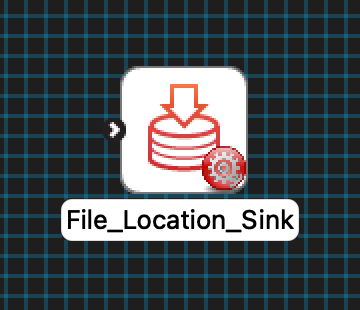
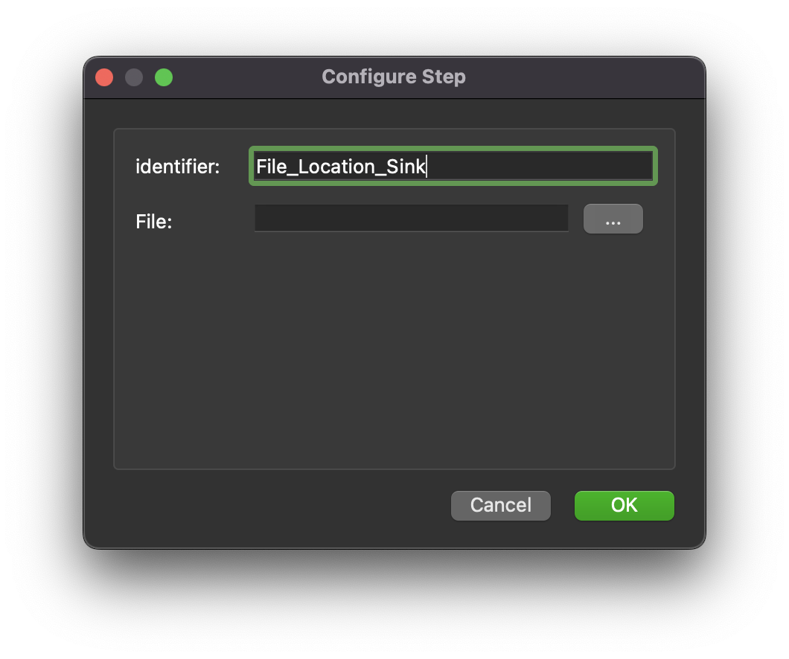

MAP Client Plugin - File Location Sink
======================================

The **File Location Sink** is MAP Client plugin for saving a file to a location outside the workflow.

.. _fig-mcp-file-location-sink-un-configured-step:

   An un-configured *File Location Sink* step icon.

Configure
---------

This step is used for saving a file to the local disk outside the workflow directory.
This step uses a *http://physiomeproject.org/workflow/1.0/rdf-schema#file_location* to define the location where the file is saved.
To set the location to save the file to use the *...* button to open a file chooser dialog.
The *File* input is used to hold the relative path from the workflow to the output file location.

.. _fig-mcp-file-location-sink-configure-dialog:

   *File Location Sink* step configuration dialog.

Ports
-----

This plugin:

* **uses**:

  * *http://physiomeproject.org/workflow/1.0/rdf-schema#file_location*
